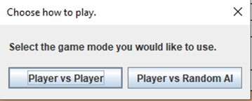
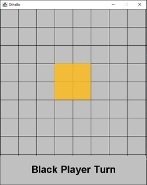
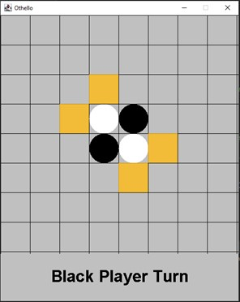
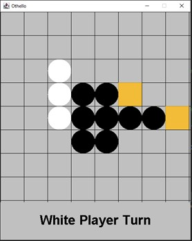
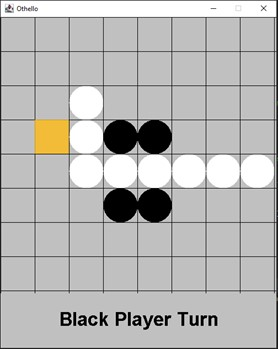
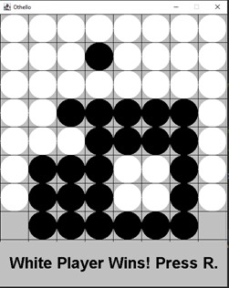

# 1.1 Othello Game Clone Overview

**Overview written by Peter Mitchell.**

## Contents

```
1.1 Othello Game Clone Overview 
1.2 Introduction 
1.3 The Rules of Othello 
1.4 High Level Discussion About Implementation 
1.5 How the Core Game Works 
1.6 Features You Could Add 
```
# 1.2 Introduction

This document will explain the fundamentals of how the Othello game works. 

- ([Youtube Demo](https://youtu.be/gIGlct4bAQs))

# 1.3 The Rules of Othello

Othello is a very simple game with rules that constrain how it is to be played. The following list
summarise the core rules of Othello.

- Played with two players (white and black). Black plays first.
- The game is played on an 8x8 grid and each turn is taken by placing a piece of the player’s
    colour onto the board to fill a single cell.
- For the first four turns the pieces may only be placed in the centre four tiles.
- After the centre four tiles have been filled, the rules for placing pieces change. You can place
    a piece on your turn if it would form a line with pieces of the opposite colour that reaches a
    piece of your own colour. For example, if pieces were “WBBBB”, the white player could place
    a white piece to the right of all the black pieces.
- When a piece is placed, all the pieces up, down, left, right that form a line like described above
    will swap to the opposite colour.
- If there is no place that a given player can play a valid move, the turn stays with the other
    player while there are no valid moves to be played.
- If both players cannot play a move the game ends. The winner is determined by counting the
    number of pieces for each colour. The winner is the player with more of their colour on the
    board. If the counts are equal, it is considered a draw.


# 1.4 High Level Discussion About Implementation

When the game is started the player is prompted with a dialogue as seen below asking if the game is
to be played in PvP or PvAI type modes. The AI does not do anything smart for choosing their moves,
they will just choose any random move from those available to them.



Below on the left you can see the initial empty board showing the middle four cells highlighted
indicating those are the only valid positions to place the first pieces. One those middle four cells have
been placed you can see on the right that pieces can be played outside of the initial four.

 

The rules for what are determined to be valid cells are based on whether the placing of a colour at a
specific position would swap the colour from the placed point up until some other point. So, you can
see that by placing a black piece at any of the positions shown will swap a single white piece.

Below is a clearer example of the taking pieces. On the left it is whites turn where there are two valid
moves. By placing a piece in the position to the far right you can see the change in game start on the
right image. All the black pieces that form a line between those pieces have swapped to show as white.

 

This sequence of each player taking turns continues until the game reaches a point where neither
player can play a move. This is either due to no valid moves in the remaining cells, or the board is
completely filled. The board does not need to be entirely filled for the game to end. As shown as in
the image below, the game has ended where the remaining two grid positions are not valid for either
player. The game can end with white wins, black wins, or a draw depending on who has more pieces
of their colour.



# 1.5 How the Core Game Works

Most of the code and structure of the game is almost identical to that of the Tic Tac Toe game. If you
have looked at how the Tic Tac Toe game was made you will see the same content with changes to
introduce the specific rules. This section will briefly summarise how the core game works by describing
the purpose of each class. For full details about each class, you can review the individual files. They
include full comments describing the purpose of each element.

Base classes:

- Position: Represents the X and Y coordinate for positions on the grid and for drawing
    elements.
- Rectangle: Combines a position with a width and height to represent an area of space in the
    panel.

Game element classes:

- GameGrid: A grid of GridCell objects representing the visual game elements and storing state
    information about the current game state.
- GridCell: An individual state element that can have a cell state to represent being empty,
    black, or white. Can also flag to render a highlight.
- SimpleAI: Plays turns randomly from the valid moves tracked in GameGrid.

Interface classes:

- Game: Controls the JFrame and manages the high-level part of the game.
- GamePanel: Controls all the elements that contribute to game state described in Game
    elements. This is where most of the logic is triggered largely from click interactions.

# 1.6 Features You Could Add

The following list of features suggest some things you could consider adding to change the game.

- Try adding a third player with a third colour. What does this change about the game?
- Change the board size. You could play with any different board size and see how it changes
    the game.
- Create a smart AI that evaluates a perfect game using minimax or other appropriate
    algorithms.
- Slow down the AI’s turns so it shows visually what they are doing with each turn.
- Create an AI vs AI mode to watch the AI battle it out.
- Have the diagonal grid cells also swap if they form lines in the normal rules.
- Show visually when a turn has been skipped.
- Add interface to show the current game state with counts to give an idea of who is winning
    numerically.
- Look at other similar games and try to add features from those games.
- Come up with a unique new rule and implement it into the game.


